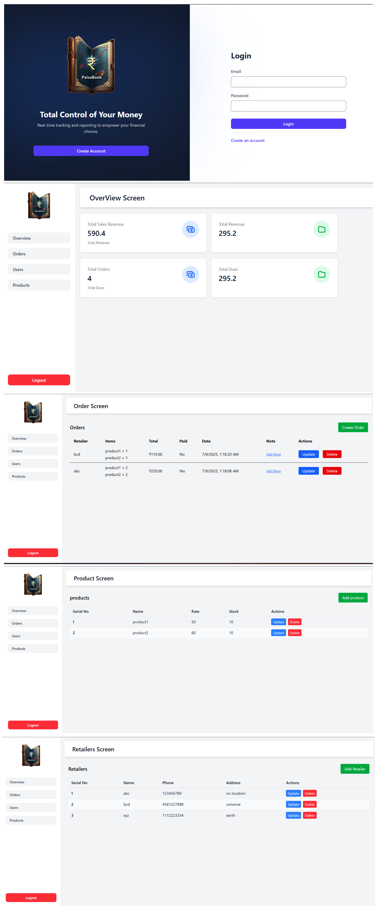

# PaisaBook 💰

PaisaBook is a full-stack application designed to help businesses manage their sales, customers, and revenue. It provides a comprehensive dashboard to track total revenue, sales amounts, and outstanding dues. The application also features role-based authentication, ensuring secure access to different functionalities.
## 🚀 Features

- **Responsive Design**: Enjoy a seamless experience on any device, from desktops to mobile phones.

- **Order Placement**: A dedicated page to finalize and place your food order.

- **Product Management**: List and manage all your products.

- **Customer Management**: Create and maintain detailed customer records.

- **Order Creation**: Easily create and track customer orders.

- **Dashboard**: Get a quick overview of your business with real-time tracking of:

   - Total Revenue

    - Total Sales

    - Total Dues

- **Role-Based Authentication**: Secure access control for different user roles.
## Tech Stack

### Frontend
- **React 19** - A JavaScript library for building user interfaces.
- **Vite** - A fast build tool for modern web projects.
- **React Router DOM** - For handling client-side routing.
- **Tailwind CSS** -For styling and layout.
- **Axios** - For API communication.
- **Date-fns**  - For date formatting.
- **Lucide-react** - Icon library.
- **React-hot-toast** - Toast notifications.


### Backend


- **Express 5** - A minimalist web framework for Node.js.

- **Sqlite**- A serverless, zero-configuration, transactional SQL database engine for Node.js.

- **Prisma** - A next-generation ORM (Object-Relational Mapper) for Node.js and TypeScript.

- **bcryptjs** - A library for hashing passwords securely.

- **jsonwebtoken** - An implementation of JSON Web Tokens for authentication.

- **cookie-parser** - A middleware to parse cookies.

- **cors** - A Node.js package for providing a Connect/Express middleware that can be used to enable Cross-Origin Resource Sharing (CORS).

- **dotenv** - A zero-dependency module that loads environment variables from a .env file.

- **body-parser** - Node.js middleware for handling request body data.

## Screenshots




## Project Installation

#### Clone the project

```bash
git clone https://github.com/Sonuku4564/PaisaBook.git

```

### Frontend Setup

Follow these steps to get the frontend running:

1.  **Navigate back to the project root and then into the `frontend` directory:**
    ```bash
    cd frontend
    ```

2.  **Install dependencies:**
    ```bash
    npm install
    ```

3.  **Start the frontend development server:**
    ```bash
    npm run dev

    ```
### Backend Setup

1.  **Navigate back to the project root and then into the `backend` directory:**
    ```bash
    cd backend
    ```
2.  **Install dependencies:**
    ```bash
    npm install
    ```
3.  **Start the backend development server:**
    ```bash
    npm start

## License

This project is licensed under the [ MIT License.](https://choosealicense.com/licenses/mit/)

